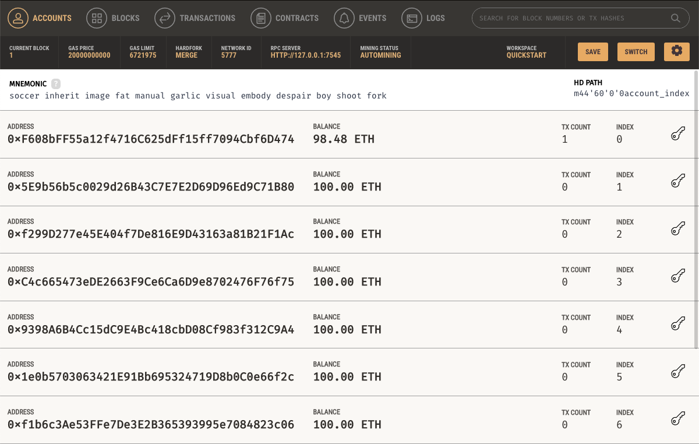

# Module 19 Challenge: Cryptocurrency Wallet

In this module, the customer is presented with a Streamlit app with professional FinTech candidates to choose from. Each candidate has their name, rating and pay rate. They also include their public key/address to facilitate payment. All transactions are completed through the blockchain, which is simulated using [Ganache](https://trufflesuite.com/ganache/).

## The App
Here's an example of the user interface:    

## The Transactions
Here's an example of the transactions in Ganache:

The customer can see their account status:    

The customer can review their transactions:    

The customer can also see further details:

